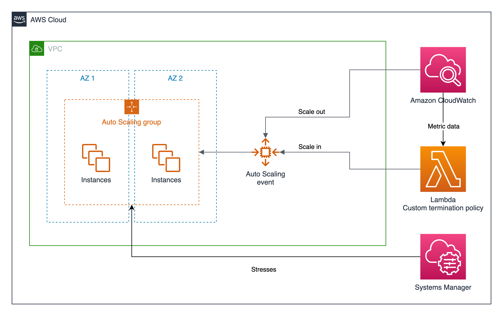
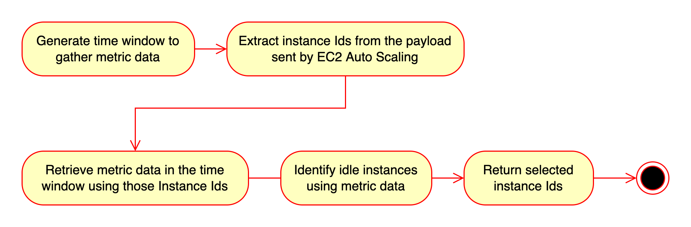

# Custom Termination Policy Example: Using CloudWatch metric data to select instances for termination

This example template demonstrates how to create a [custom termination policy](https://docs.aws.amazon.com/autoscaling/ec2/userguide/lambda-custom-termination-policy.html) for an EC2 Auto Scaling group that uses CloudWatch metric data to select idle instances for termination. The stack will deploy the following resources:

- A VPC that spans the whole region
- A Lambda function that implements the logic of the custom termination policy
- An Auto Scaling Group with a target tracking scaling policy, where the target metric is the average CPU consumption
- A Launch Template that defines the AMI to use when procuring capacity in the Auto Scaling Group
- A Systems Manager Document that executes [stress-ng](https://wiki.ubuntu.com/Kernel/Reference/stress-ng) within a shell script
- A State Manager association that applies the SSM Document to all the instances in the ASG

The diagram below shows the architecture that will be deployed:

## Architecture diagram



The Lambda function is invoked by Amazon EC2 Auto Scaling in response to certain events. It processes the information in the input data sent by Amazon EC2 Auto Scaling and returns a list of instances that are ready to terminate. This example returns all instances whose average CPU utilization is below 50% during 5 minutes. To do this, the function performs an API call to retrieve metric data from Amazon CloudWatch. The state diagram below depicts the execution flow of the Lambda function:



## Expected outcome

Once the stack is deployed, the following events will take place:

1. As many instances as specified in the parameter **DesiredCapacity** are launched to meet the initial demand for the ASG
2. The State Manager Association is automatically applied, increasing the CPU usage of the instances in the ASG
3. The dynamic scaling policy is triggered, since the target 50% of CPU usage is no longer met
4. The desired capacity of the ASG is increased to meet the new demand, and new instances are launched to procure more capacity
5. Some minutes after the State Manager Association is applied, the scale-in event is triggered invoking the Lambda function
6. The Lambda function selects instances for termination and the desired capacity of the ASG is updated accordingly

Some tips:

- You can verify the execution of the Lambda Function by:
  - Navigating to the [Lambda console](https://console.aws.amazon.com/lambda)
  - Selecting the function **customTerminationPolicy**
  - Selecting the **Monitor** tab and scrolling down to **Recent invocations**
- You can apply the State Manager Association whenever you want by:
  - Navigating to the [State Manager console](https://console.aws.amazon.com/systems-manager/state-manager)
  - Ticking the Association whose Document name is **Stress** and selecting **Apply association now**

## Getting Started

We recommend deploying the following [Example AWS Cloud9 Environment](/environment/README.md) to get started quickly with this example. Otherwise, you can attempt to run this example using your own environment with the following prerequisites installed.

### Prerequisites

* [AWS CLI](https://docs.aws.amazon.com/cli/latest/userguide/cli-chap-install.html) installed and configured with Administrator credentials.

## Deployment Steps

Once you've deployed and accessed the [Example AWS Cloud9 Environment](/environment/README.md) execute the following steps from within the Example AWS Cloud9 Environment to deploy this example.

1. Change directories to this example:

```bash
cd ~/environment/amazon-ec2-auto-scaling-group-examples/features/custom-termination-policies/cloudwatch-metrics
```

2. Deploy the CloudFormation Stack:

```bash
aws cloudformation deploy \
    --template-file template.yaml \
    --stack-name custom-termination-policy \
    --capabilities CAPABILITY_IAM
```

## Clean Up

Delete the CloudFormation Stack

```bash
aws cloudformation delete-stack --stack-name custom-termination-policy
```